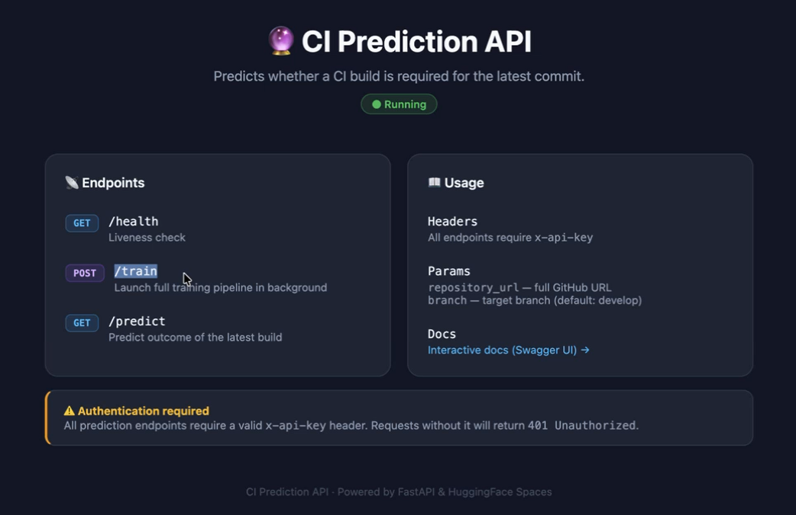

# 2. Solución propuesta

## 2.1. Enfoque y alcance

La memoria del proyecto planteaba un sistema de IA capaz de generar automáticamente pipelines de CI/CD a partir de metamodelos de operaciones, de forma agnóstica respecto al *stack* tecnológico y a la plataforma de ejecución. Durante la investigación se constató que modelar los pipelines para abarcar toda la diversidad tecnológica resultaría inabarcable y quedaría obsoleto rápidamente, dada la velocidad con la que evolucionan los lenguajes, los *frameworks* y las herramientas de integración.

Por ello, en lugar de modelar los pipelines, se optó por un modelo de machine learning agnóstico que, ante cada *commit*, predice si el *build* resultará correcto o fallido sin necesidad de ejecutarlo. La lógica, acordada entre los socios académicos e industriales, es la siguiente:

- **Si se predice fallo**, merece la pena ejecutar el *build*, porque revelará un error que hay que corregir.
- **Si se predice éxito**, se puede omitir su ejecución, porque no aportaría información nueva.

De este modo se mantiene el propósito esencial de la integración continua, que es detectar los errores cuanto antes, pero optimizando los recursos y reduciendo el gasto computacional.

En este planteamiento, la tarea T3.4.4 desarrolla el conector entre el modelo y la herramienta de integración: una plataforma web que incorpora automáticamente el modelo a un pipeline existente, sin que el equipo de desarrollo tenga que modificarlo a mano. La solución se ha implementado y validado sobre GitHub Actions y, por diseño, es aplicable a otras plataformas basadas en Git.

## 2.2. Visión general

El uso de la plataforma se desarrolla en tres pasos:

1. **Datos del repositorio.** El usuario indica el repositorio, la rama y la ruta del pipeline, junto con un token de acceso.
2. **Revisión de cambios.** La plataforma analiza el pipeline y muestra, en formato de comparación de código, los cambios que propone para incorporar el modelo.
3. **Subida de cambios.** El usuario elige una rama de destino y la plataforma sube los cambios al repositorio, donde el equipo puede revisarlos e integrarlos mediante el flujo habitual de *pull requests*.

A partir de ese momento, cada ejecución del pipeline consulta al modelo y decide si ejecuta el *build*.

[PENDIENTE: diagrama de flujo del proceso completo, desde los datos del repositorio hasta la ejecución del pipeline adaptado.]

## 2.3. Arquitectura

La solución se compone de dos elementos principales:

- **Plataforma web.** Aplicación con la apariencia común de las aplicaciones del proyecto SOFIA, cuya interfaz se ha diseñado deliberadamente sencilla, en línea con el requisito de facilidad de uso. Se encarga de conectarse al repositorio, analizar el pipeline, generar los cambios y subirlos a la rama indicada. No almacena datos de los repositorios ni de los usuarios: cada operación es independiente, de modo que la plataforma puede aplicarse sucesivamente a distintos repositorios.
- **Servicio de predicción.** Servicio que expone el modelo de machine learning mediante una API (Figura 1), construido por AYESA-DIGITAL a partir del modelo y del código de entrenamiento desarrollados en la línea.

*Figura 1. API del servicio de predicción.*

| Operación | Función |
|---|---|
| `POST /train` | Lanza en segundo plano el proceso completo de entrenamiento del modelo para un repositorio. |
| `GET /predict` | Predice el resultado del *build* correspondiente al último *commit* de una rama. |
| `GET /health` | Comprueba la disponibilidad del servicio. |

*Tabla 2. Operaciones de la API del servicio de predicción.*

Todas las operaciones requieren autenticación mediante una clave de API. Los parámetros principales son la URL del repositorio y la rama.

[PENDIENTE: diagrama de arquitectura de la solución.]

## 2.4. Modelo de predicción y entrenamiento

El modelo de predicción procede de la tarea T3.4.3, desarrollada en colaboración con la Universidad de Málaga, cuyo entregable documenta los datos y criterios en que se basa la predicción y la comparativa de modelos realizada para seleccionarlo. [PENDIENTE: confirmar que el modelo está documentado en E3.4.3 y la referencia exacta.]

El modelo se entrena de forma específica para cada repositorio en el que se va a utilizar:

- **Entrenamiento por repositorio.** La operación de entrenamiento obtiene del repositorio la información que necesita el modelo y lo entrena con ella, de modo que las predicciones se ajustan a las características de cada proyecto.
- **Entrenamiento acumulativo.** Cada nuevo entrenamiento incorpora los datos generados desde el anterior y utiliza todo el histórico del repositorio, de modo que el modelo gana precisión con el uso.
- **Entrenamiento a demanda.** El entrenamiento se lanza cuando se decide, mediante la API, y no de forma automática con cada *commit*.

## 2.5. Código incorporado al pipeline

La plataforma realiza dos cambios en el pipeline existente, que se muestran en detalle en el apartado 3.2:

1. **Un nuevo paso de predicción** ("Check if build is required"), situado antes del *build*, que consulta al servicio de predicción para el repositorio y la rama en que se está ejecutando el pipeline. El paso registra la respuesta completa y publica su estado para que lo usen los pasos siguientes.
2. **Una condición adicional en el paso de *build***, que solo se ejecuta si el estado devuelto es `BUILD_REQUIRED`. Las condiciones que ya tuviera el pipeline se conservan.

El servicio responde con dos estados posibles:

| Estado | Significado | Efecto en el pipeline |
|---|---|---|
| `BUILD_REQUIRED` | El modelo estima que el *build* puede fallar | Se ejecuta el *build* |
| `BUILD_OPTIONAL` | El modelo estima que el *build* resultará correcto | Se omite el *build* |

*Tabla 3. Estados de la predicción y efecto en el pipeline.*

La respuesta incluye, además, una estimación del riesgo de fallo del *build*.

El resto del pipeline (pruebas unitarias, pasos posteriores, despliegue) no se modifica. Los cambios se limitan al mínimo necesario para incorporar el modelo y respetan la estructura y las condiciones existentes, lo que facilita su revisión por parte del equipo.

## 2.6. Seguridad

La solución aplica buenas prácticas en el tratamiento de credenciales:

- El acceso al repositorio se realiza mediante un token del propio usuario, con permisos de lectura y escritura sobre el repositorio.
- La clave de acceso a la API de predicción no se escribe en el pipeline: se referencia como *secret* del repositorio, gestionado por la propia plataforma de integración.
- Los cambios se suben a la rama de destino que elige el usuario, lo que permite que pasen por el proceso habitual de revisión antes de integrarse en la rama principal.
