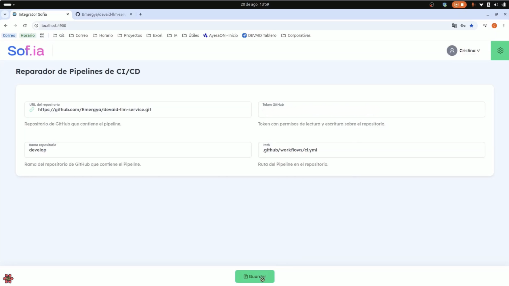
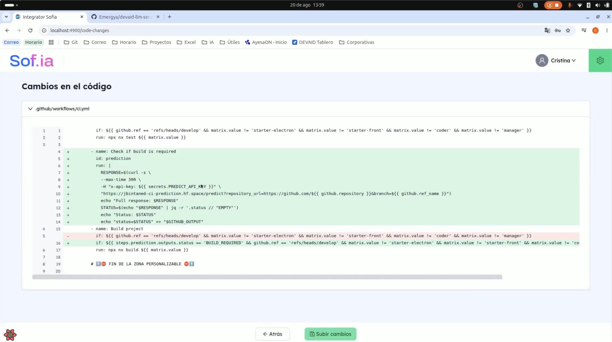
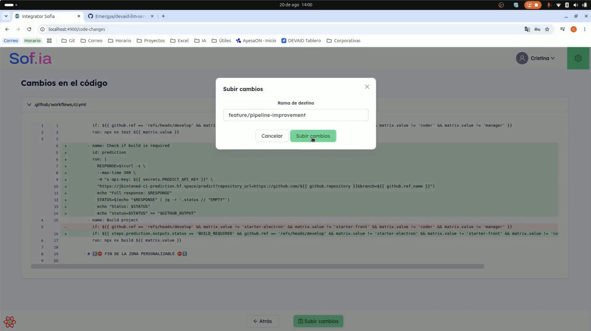
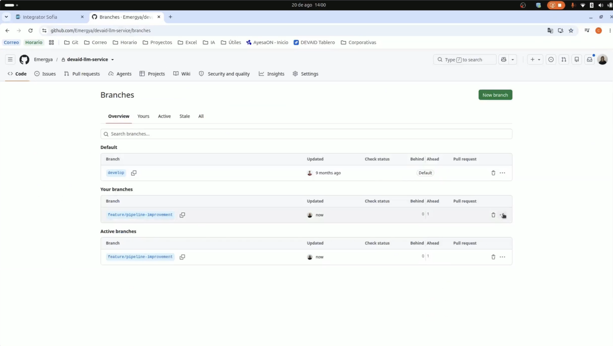
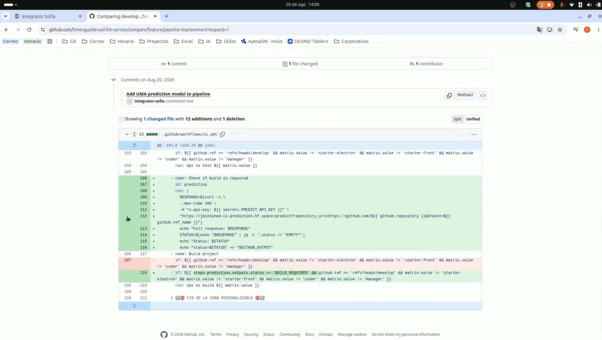
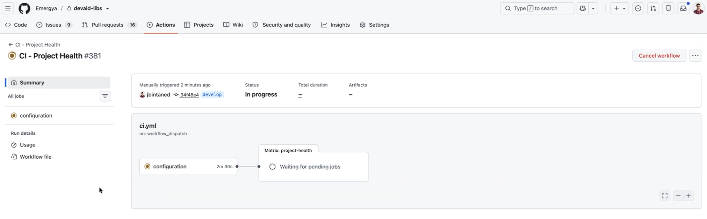
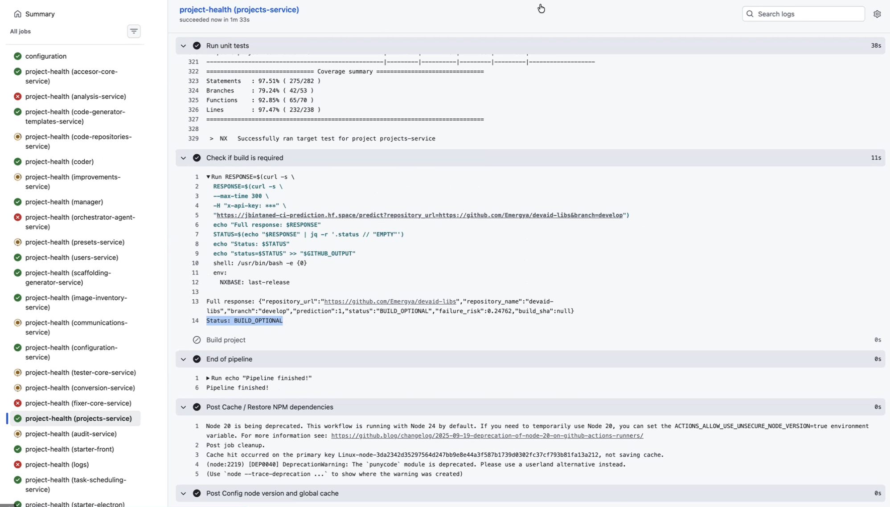

# 3. Funcionamiento de la plataforma

Este apartado describe el uso de la plataforma sobre un repositorio real de AYESA-DIGITAL, cuyo pipeline de GitHub Actions se adapta para incorporar el modelo de predicción, y muestra el resultado de ejecutar un pipeline adaptado.

## 3.1. Paso 1: datos del repositorio

Una vez iniciada la sesión, el usuario accede a la pantalla principal de la plataforma (Figura 2), donde indica:

- **URL del repositorio** que contiene el pipeline.
- **Token** de acceso con permisos de lectura y escritura sobre el repositorio, generado por el usuario en su plataforma de control de versiones.
- **Rama** del repositorio que contiene el pipeline.
- **Ruta** del fichero del pipeline en el repositorio (en el ejemplo, `.github/workflows/ci.yml`).

*Figura 2. Paso 1: datos del repositorio (token anonimizado).*

Al pulsar **Guardar**, la plataforma accede al repositorio, analiza el pipeline y genera los cambios necesarios.

## 3.2. Paso 2: revisión de los cambios

La plataforma presenta los cambios propuestos en formato de comparación de código, similar al que utiliza GitHub: en verde las líneas añadidas y en rojo las eliminadas (Figura 3).

*Figura 3. Paso 2: cambios propuestos en el pipeline.*

En el ejemplo se aprecian los dos cambios descritos en el apartado 2.5:

- **Líneas 4 a 14**: el nuevo paso "Check if build is required", que consulta al servicio de predicción con la clave de API almacenada como *secret*, el repositorio y la rama en ejecución, extrae el estado de la respuesta y lo publica como salida del paso.
- **Línea 16**: la condición del paso "Build project", que ahora exige, además de las condiciones que ya existían, que el estado de la predicción sea `BUILD_REQUIRED`.

Esta pantalla permite al usuario comprobar exactamente qué se va a modificar antes de aplicarlo.

## 3.3. Paso 3: subida de los cambios

Al pulsar **Subir cambios**, la plataforma solicita la rama de destino (Figura 4). En el ejemplo se utiliza una rama nueva, `feature/pipeline-improvement`.

*Figura 4. Paso 3: selección de la rama de destino.*

Al confirmar, la plataforma sube los cambios al repositorio, notifica que se han aplicado correctamente y deja el formulario preparado para procesar otro repositorio.

## 3.4. Resultado en el repositorio

Los cambios quedan reflejados en el repositorio como una rama nueva, con un *commit* por delante de la rama de origen (Figura 5).

*Figura 5. Rama creada en el repositorio.*

El *commit* "Add UMA prediction model to pipeline", realizado por el usuario técnico de la plataforma, modifica un único fichero, el pipeline, con 12 líneas añadidas y 1 eliminada (Figura 6). Su contenido coincide exactamente con el que mostró la plataforma en el paso 2. A partir de aquí, el equipo puede abrir una *pull request* e integrar el cambio mediante su proceso habitual.

*Figura 6. Commit con los cambios en el pipeline.*

## 3.5. Ejecución del pipeline adaptado

La ejecución del pipeline adaptado tiene lugar en el repositorio del usuario, fuera de la plataforma. Para comprobar su funcionamiento, el código incorporado se ha ejecutado en distintos proyectos. Este apartado muestra una ejecución en un repositorio de librerías con más de veinte servicios.

El pipeline de ese repositorio consta de un trabajo de configuración, que prepara el entorno y detecta los proyectos afectados, seguido de una matriz de trabajos con uno por servicio (Figura 7). Cada trabajo de la matriz ejecuta las pruebas unitarias del servicio, el paso de predicción y, si procede, el *build*.

*Figura 7. Resumen de la ejecución del pipeline.*

La Figura 8 muestra el resultado para uno de los servicios. Tras superar las pruebas unitarias, el paso "Check if build is required" consulta al servicio de predicción y obtiene el estado `BUILD_OPTIONAL`, con un riesgo de fallo estimado de 0,25. En consecuencia, **el paso "Build project" se omite**, como indica su icono, y el pipeline continúa hasta finalizar correctamente.

*Figura 8. Predicción `BUILD_OPTIONAL` y omisión del build.*

Esta ejecución demuestra el ciclo completo de la solución: el cambio incorporado por la plataforma consulta al modelo en tiempo de ejecución y el pipeline actúa según su predicción, sin intervención manual.

Como el cambio se realiza en la definición común del pipeline, un único cambio aplicado por la plataforma incorpora el modelo a todos los servicios de la matriz.
