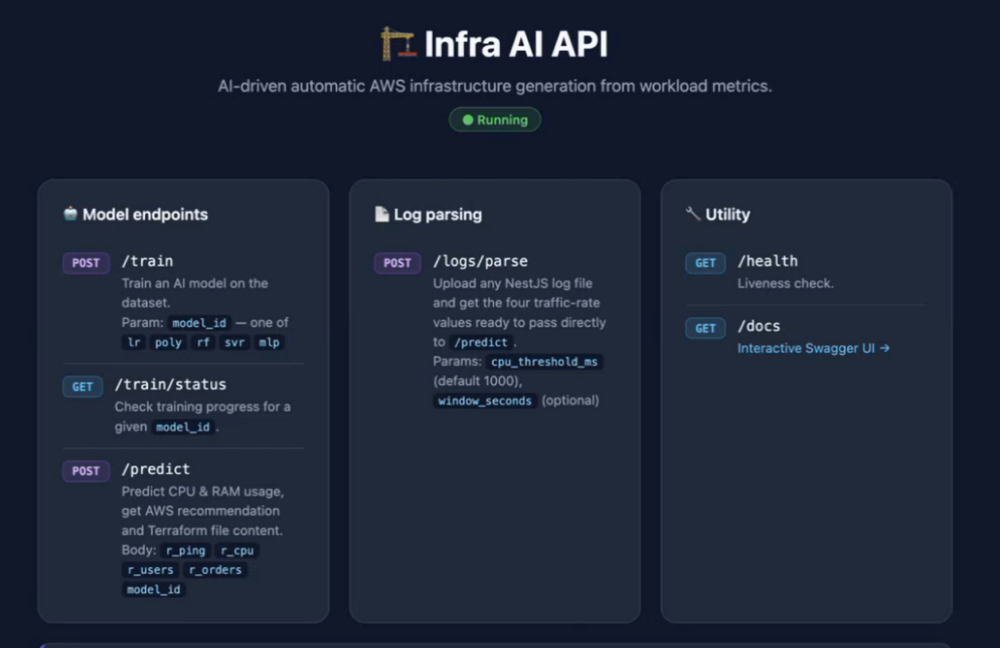

# 2. Solución propuesta

## 2.1. Enfoque y alcance

La memoria del proyecto planteaba un sistema de IA capaz de generar la infraestructura de despliegue de forma agnóstica, es decir, independientemente de su tipo (on-premise, AWS, Kubernetes u otras), a partir de la caracterización del componente de software, de modo que incluso un perfil no experto en infraestructura pudiera obtenerla.

Durante el desarrollo del algoritmo (tarea T3.5.3) se optó por abordar primero el problema en su forma más acotada y verificable: el dimensionamiento de un servicio desplegado en una única instancia de computación. Este enfoque permite validar la capacidad central del sistema, que es traducir la carga de trabajo de un servicio (peticiones por segundo) en requisitos de hardware concretos, sin introducir aún la complejidad de distribuir la carga entre varios nodos, que el propio entregable E3.5.3 identifica como evolución natural del modelo (E3.5.3, apartado 6.4).

La interfaz desarrollada en T3.5.4 se construye sobre ese enfoque y lo lleva a un uso práctico:

- **Entrada basada en datos reales.** En lugar de requerir que el usuario describa manualmente su componente, la aplicación parte de los *logs* de uso del servicio y obtiene de ellos automáticamente su caracterización (véase el apartado 2.4). Así se cumple el propósito de la memoria de que un perfil no experto pueda utilizar el sistema, con una caracterización más objetiva que la que proporcionaría una descripción manual.
- **Salida concreta y desplegable.** El sistema recomienda una instancia de AWS y genera el código Terraform correspondiente, listo para desplegar.
- **Arquitectura preparada para evolucionar.** Los elementos que dependen de un proveedor o de un formato concreto (el adaptador de *logs*, el catálogo de instancias y la plantilla de infraestructura) están aislados del núcleo del sistema, de modo que su ampliación a otros formatos y proveedores no requiere modificar el núcleo ni reentrenar los modelos (apartado 2.7).

Este planteamiento es coherente con el objetivo general OG2 del proyecto, que establece la realización de pruebas de concepto para validar las tecnologías investigadas en un nivel de madurez TRL4, como base para desarrollos e industrialización futuros.

## 2.2. Visión general

La aplicación guía al usuario a lo largo de tres pasos:

1. **Subida de *logs*.** El usuario aporta el fichero de *logs* de su servicio y, opcionalmente, ajusta dos parámetros de análisis.
2. **Predicción de infraestructura.** La aplicación muestra la caracterización de la carga obtenida de los *logs*, que el usuario puede revisar o ajustar, y le permite elegir el modelo de predicción.
3. **Resultados.** La aplicación presenta el consumo estimado de CPU y memoria, la instancia recomendada con su coste y el código Terraform de la infraestructura.

[PENDIENTE: diagrama de flujo del proceso completo, de los *logs* al código Terraform.]

## 2.3. Arquitectura

El sistema se compone de dos elementos principales:

- **Frontend.** Interfaz web con la apariencia común de las aplicaciones del proyecto SOFIA. El acceso se realiza mediante el sistema de autenticación de la plataforma corporativa en la que se integran dichas aplicaciones.
- **Backend.** Servicio desarrollado íntegramente en Python que expone, mediante una API, las funciones de análisis de *logs*, predicción y generación de infraestructura (Figura 1).

*Figura 1. API del backend del generador de infraestructura.*

La API se organiza en tres grupos de operaciones:

| Grupo | Operación | Función |
|---|---|---|
| Análisis de *logs* | `POST /logs/parse` | Recibe un fichero de *logs* y devuelve las cuatro tasas de carga listas para la predicción. Admite como parámetros el umbral de CPU (por defecto, 1000 ms) y la ventana temporal (opcional). |
| Modelos | `POST /predict` | A partir de las cuatro tasas y del modelo elegido, predice el uso de CPU y memoria, recomienda la instancia de AWS y devuelve el código Terraform. |
| Modelos | `POST /train`, `GET /train/status` | Permiten reentrenar los modelos y consultar el estado del entrenamiento. |
| Utilidades | `GET /health`, `GET /docs` | Comprobación de disponibilidad y documentación interactiva de la API. |

*Tabla 2. Operaciones de la API del backend.*

[PENDIENTE: diagrama de arquitectura con los componentes del sistema y sus puntos de extensión.]

## 2.4. Caracterización de la carga a partir de los *logs*

La memoria del proyecto requiere que el usuario pueda indicar la tipología del componente de software. En la solución desarrollada, esa tipología se obtiene de forma automática: el backend analiza los *logs* del servicio y clasifica cada una de sus operaciones (*endpoints*) en una de las cuatro clases de carga con las que se entrenaron los modelos en la tarea T3.5.3:

| Clase | Tipo de carga | Ejemplo |
|---|---|---|
| r_ping | Peticiones ligeras de comprobación de estado | *Health checks* |
| r_cpu | Operaciones de cálculo intensivo en CPU | Procesamientos costosos |
| r_users | Lecturas contra base de datos | Consultas de usuarios |
| r_orders | Escrituras transaccionales contra base de datos | Registro de pedidos |

*Tabla 3. Clases de carga de trabajo.*

Para cada clase, la aplicación calcula la tasa de peticiones por segundo del servicio. Estas cuatro tasas constituyen la caracterización del componente que alimenta a los modelos de predicción.

La clasificación se apoya en la información que registran los *logs* para cada llamada, en particular la operación invocada y su tiempo de procesamiento. Las operaciones cuyo tiempo supera un umbral configurable se consideran de cálculo intensivo (clase r_cpu). La trazabilidad de las operaciones en los *logs* es un requisito habitual de los sistemas que pasan a producción, con independencia del lenguaje de programación, lo que hace que este tipo de fuente de datos esté ampliamente disponible.

Este enfoque presenta dos ventajas frente a una selección manual de la tipología:

- **No requiere conocimiento experto.** El usuario no necesita saber clasificar su componente; basta con que aporte sus *logs*.
- **Se basa en el comportamiento real.** La caracterización refleja la carga que el servicio soporta efectivamente, no una estimación subjetiva.

## 2.5. Modelos de predicción

La aplicación integra los modelos de aprendizaje supervisado desarrollados en la tarea T3.5.3, que estiman el consumo de CPU y memoria de un servicio a partir de las cuatro tasas de carga. Para la aplicación, estos modelos se reentrenaron con *logs* de uso real de servicios de AYESA-DIGITAL.

El usuario puede elegir entre cuatro modelos: red neuronal (perceptrón multicapa, MLP), *Random Forest*, regresión lineal y regresión de vectores de soporte (SVR). La red neuronal es el modelo recomendado, ya que fue seleccionada como modelo principal en la tarea T3.5.3 por su mayor capacidad para modelar el comportamiento no lineal del consumo de memoria (E3.5.3, apartado 6). Los demás modelos se mantienen disponibles como alternativas para la comparación.

[PENDIENTE: confirmar si la interfaz marca la red neuronal como opción recomendada o por defecto; si no, indicarlo así en el texto.]

A partir del consumo estimado, el sistema selecciona en su catálogo de instancias de AWS la **instancia más económica que satisface la carga sostenida**, aplicando un margen de seguridad sobre la demanda estimada, y genera el código Terraform para desplegarla.

## 2.6. Capa de control

Los modelos de aprendizaje automático pueden producir resultados poco fiables cuando reciben datos muy alejados de aquellos con los que fueron entrenados, o incluso resultados físicamente imposibles. Para evitarlo, el sistema incorpora la capa de control diseñada en la tarea T3.5.3, que supervisa las entradas y las salidas de los modelos:

- **Control de entradas.** Si un valor supera el rango observado durante el entrenamiento, se ajusta al máximo de dicho rango para evitar extrapolaciones.
- **Control de salidas.** Si una predicción resulta físicamente imposible (por ejemplo, un uso de CPU superior al 100 %), se corrige al límite físico.

La aportación de la interfaz consiste en hacer visible esta capa al usuario: cada ajuste se comunica mediante un aviso explícito que indica qué valor se ha corregido y por qué (apartado 3.5). Esto resulta especialmente relevante porque la aplicación permite al usuario modificar manualmente los valores obtenidos de los *logs*.

## 2.7. Extensibilidad

La arquitectura aísla en tres puntos los elementos que dependen de un formato o de un proveedor concretos:

| Punto de extensión | Situación actual | Ampliación |
|---|---|---|
| Adaptador de *logs* | Formato de *log* de las aplicaciones de AYESA-DIGITAL (NestJS), generado por una librería disponible para numerosos lenguajes | Añadir un adaptador para cada nuevo formato |
| Catálogo de instancias | Instancias de AWS con sus características y coste | Incorporar catálogos de otros proveedores o de infraestructura propia |
| Plantilla de infraestructura | Código Terraform para AWS | Incorporar plantillas para otros proveedores o entornos |

*Tabla 4. Puntos de extensión del sistema.*

En ningún caso la ampliación requiere reentrenar los modelos ni modificar el núcleo del sistema, ya que los modelos trabajan sobre las cuatro tasas de carga, que son independientes del formato de origen y del proveedor de destino. Además, la API ya contempla el reentrenamiento de los modelos, de modo que estos puedan actualizarse periódicamente con nuevos datos para ganar precisión.
