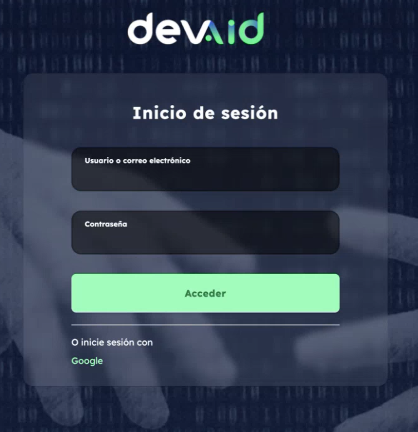
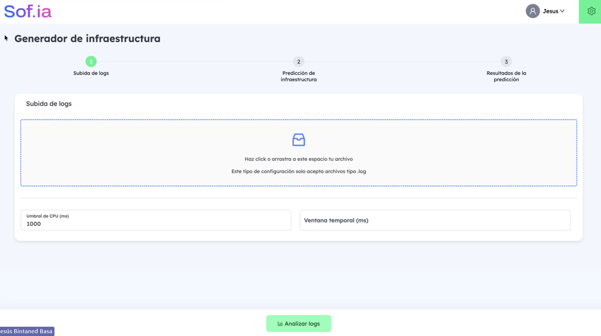
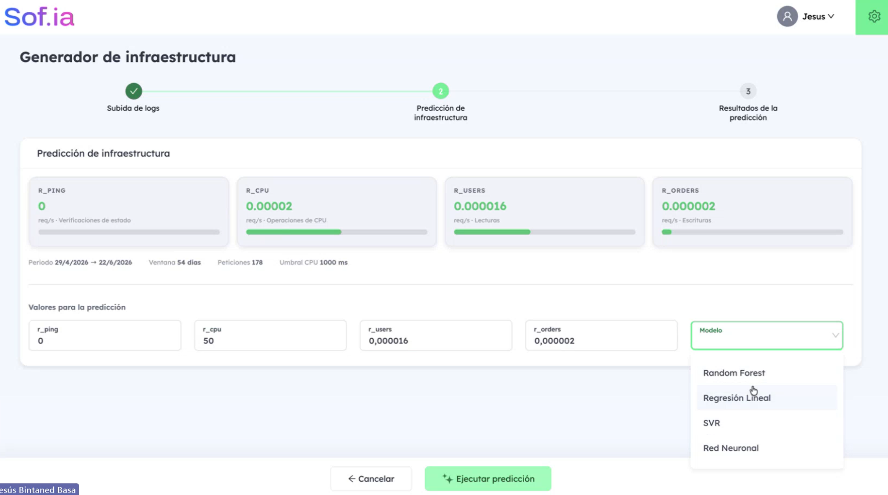
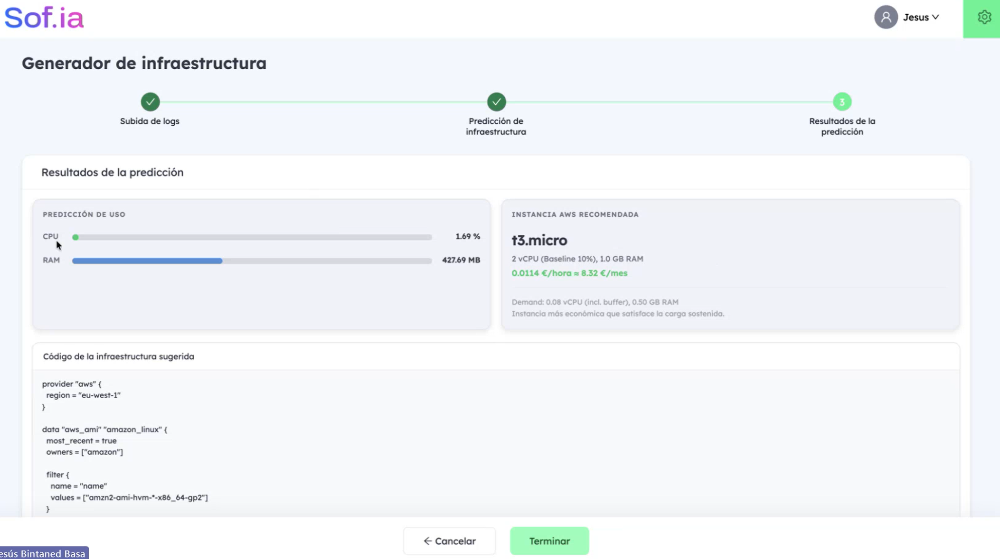
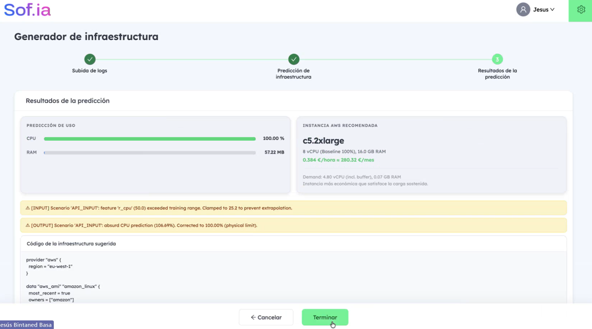

# 3. Funcionamiento de la aplicación

Este apartado describe el uso de la aplicación mediante un caso real: el análisis de los *logs* de un microservicio de AYESA-DIGITAL desplegado desde hace tiempo y con poco tráfico.

## 3.1. Acceso

El usuario accede a la aplicación mediante el sistema de autenticación común de la plataforma corporativa, con usuario y contraseña o con una cuenta de Google (Figura 2).

*Figura 2. Pantalla de acceso.*

## 3.2. Paso 1: subida de *logs*

En el primer paso, el usuario selecciona o arrastra el fichero de *logs* del servicio (Figura 3). Puede proceder de un entorno de producción, de preproducción o de pruebas, o de una aplicación en local que se vaya a desplegar.

*Figura 3. Paso 1: subida de logs.*

El usuario puede ajustar dos parámetros de análisis:

- **Umbral de CPU (ms).** Tiempo de procesamiento a partir del cual una operación se considera de cálculo intensivo. El valor por defecto es 1000 ms, y puede adaptarse a la naturaleza de cada aplicación: en una, una operación de 100 ms puede ser costosa; en otra, solo lo serán las que superen los 5 segundos.
- **Ventana temporal (ms).** Permite limitar el análisis al tramo más reciente del fichero (el último día, la última semana o el último mes). Si se deja vacía, se analiza el fichero completo. Resulta útil cuando un servicio lleva meses desplegado en un entorno de pruebas, pero solo son representativos los datos de las pruebas recientes.

Al pulsar **Analizar logs**, el fichero se envía al backend, que lo procesa en pocos instantes.

## 3.3. Paso 2: predicción de infraestructura

En el segundo paso, la aplicación muestra la caracterización de la carga obtenida de los *logs*: la tasa de peticiones por segundo de cada una de las cuatro clases, junto con el periodo analizado, la ventana temporal, el número de peticiones y el umbral aplicado (Figura 4).

*Figura 4. Paso 2: caracterización de la carga y selección del modelo.*

En el caso mostrado se analizaron 54 días de actividad (del 29 de abril al 22 de junio de 2026), con 178 peticiones. Las tasas obtenidas son muy bajas, como corresponde a un servicio con poco tráfico. La tasa de la clase r_ping es nula porque el servicio no registra operaciones de comprobación de estado.

Los valores obtenidos se trasladan a un formulario editable. El usuario puede corregirlos o ajustarlos si conoce información que los *logs* no reflejan (por ejemplo, un número conocido de comprobaciones de estado por segundo) o si desea dimensionar la infraestructura con más margen. En la Figura 4, el valor de r_cpu ya se ha modificado manualmente a 50, caso que se retoma en el apartado 3.5. A continuación, el usuario elige el modelo de predicción y pulsa **Ejecutar predicción**.

## 3.4. Paso 3: resultados de la predicción

El tercer paso presenta el resultado (Figura 5):

- **Predicción de uso**: el consumo estimado de CPU (en porcentaje) y de memoria (en MB).
- **Instancia de AWS recomendada**: sus características (vCPU y memoria), su coste por hora y por mes, y la demanda estimada que ha servido de base para elegirla.
- **Código de la infraestructura sugerida**: el código Terraform para desplegar la instancia.

*Figura 5. Paso 3: resultados de la predicción con los valores obtenidos de los logs.*

En el caso analizado, el sistema estima un uso de CPU del 1,69 % y un consumo de memoria de 427,69 MB, y recomienda una instancia t3.micro (2 vCPU con rendimiento base del 10 % y 1 GB de memoria), con un coste de 0,0114 €/hora (unos 8,32 €/mes). La demanda estimada, que incluye un margen de seguridad, es de 0,08 vCPU y 0,50 GB de memoria, por lo que la instancia elegida cubre la carga con holgura sin sobredimensionarla.

El código Terraform generado define la infraestructura básica para desplegar la instancia y sirve como punto de partida que el equipo puede personalizar según sus necesidades.

## 3.5. Avisos de la capa de control

Cuando el usuario introduce manualmente valores que se alejan de los datos de entrenamiento, la aplicación aplica la capa de control descrita en el apartado 2.6 y lo comunica mediante avisos (Figura 6).

*Figura 6. Avisos de la capa de control ante valores fuera de rango.*

En el ejemplo, el usuario fija manualmente la tasa r_cpu en 50 peticiones por segundo. La aplicación muestra dos avisos:

- **Entrada**: el valor 50 supera el rango de entrenamiento y se ajusta a 25,2, el máximo observado, para evitar una extrapolación.
- **Salida**: el modelo predice un uso de CPU del 106,69 %, físicamente imposible, que se corrige al 100 %.

Con estos valores ajustados, el sistema recomienda una instancia c5.2xlarge (8 vCPU y 16 GB de memoria), con un coste de 0,384 €/hora (unos 280,32 €/mes). Los avisos permiten al usuario entender qué se ha corregido y por qué, y evitan que obtenga una recomendación basada en valores incoherentes.
